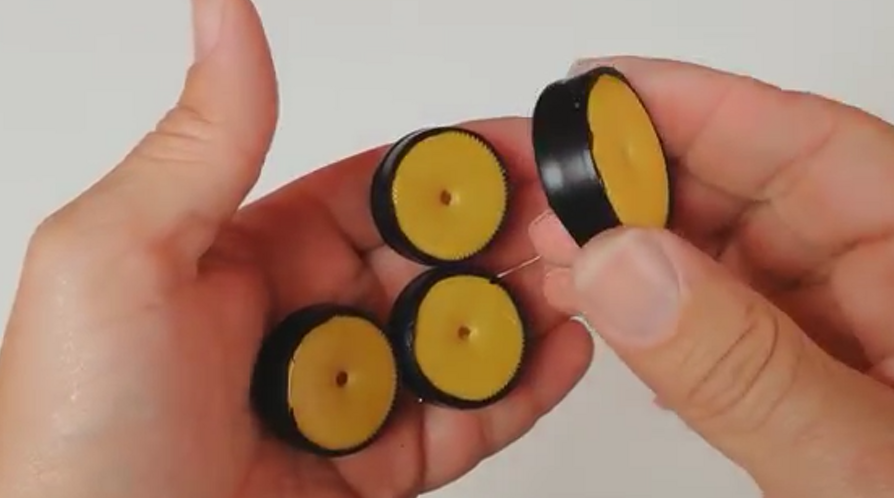

## Curso Robótica 
### Clase de  Electrónica | Carrito Eléctrico

----------------

#### Presentaciones en: [cursorobotica.cuban.tech/e_car.html](http://cursorobotica.cuban.tech/e_car.html)

#### Autor : Ariel Lima
###### powered by [reveal.js](https://revealjs.com/)

--

## Outline

 - Carrito Eléctrico
   * Materiales Necesarios
   * Pasos a Seguir
   * Tips
   * Otros Modelos
   * ¿Después?

---

#### El Carrito

---

####  Materiales 

--

#### Lista  de Materiales Necesarios
   * Dos Pomos Plásticos
   * Cutter
   * Tijeras
   * 4 Tapitas de Pomo
   * Pistola de Silicona
   * Tape
   * Pistola de Silicona
   * Pegamento
   * Pajillas
   * Palitos o Alambres
   * Otros

---

####  Pasos a seguir

--

--

--

--

--

--

--

--

#### Hélice

--

--

--

--

### Motor

--

--

---

### Tips

--

--

--

---

### Variantes

--

--

--

